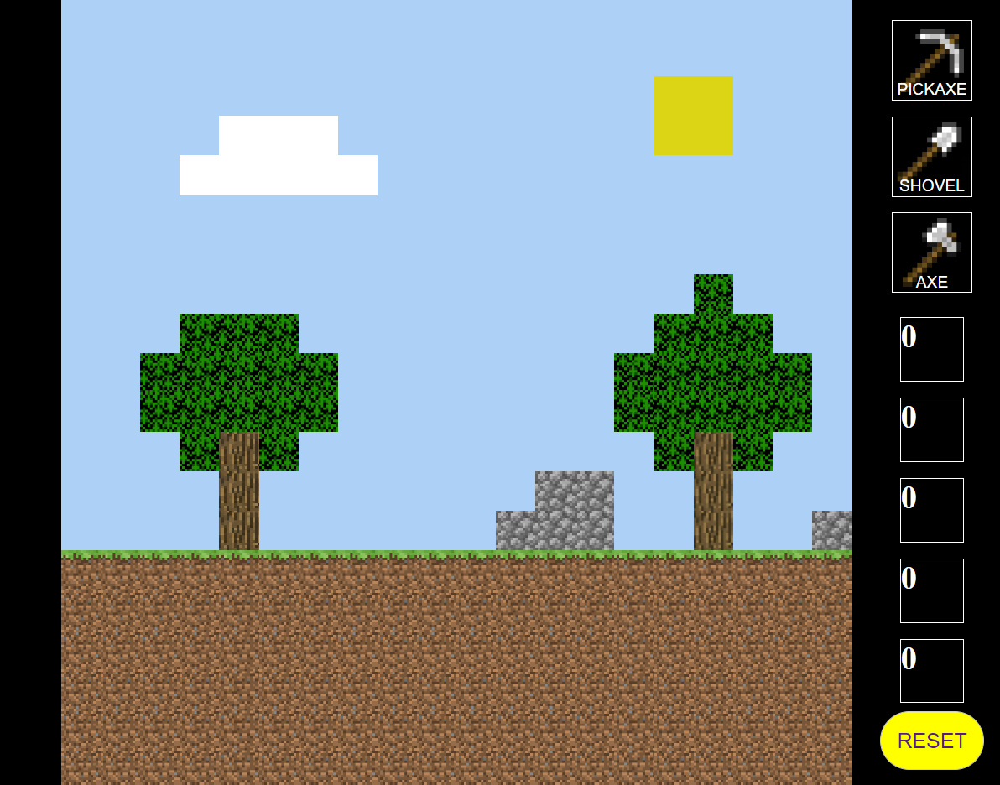

# Minecraft (28.4.2022)

**Version 1.0.0**

------------------------------------------------
## Description

Minecraft is a two-pages responsive game, created using Javascript, HTML and CSS. 

The game purpose is to create structures using the existing blocks.

## Demo

https://sparkling-quokka-26a4b4.netlify.app/

------------------------------------------------
## Contributors

-Naama G. 
------------
## License & copyright

&copy; Naama G.
